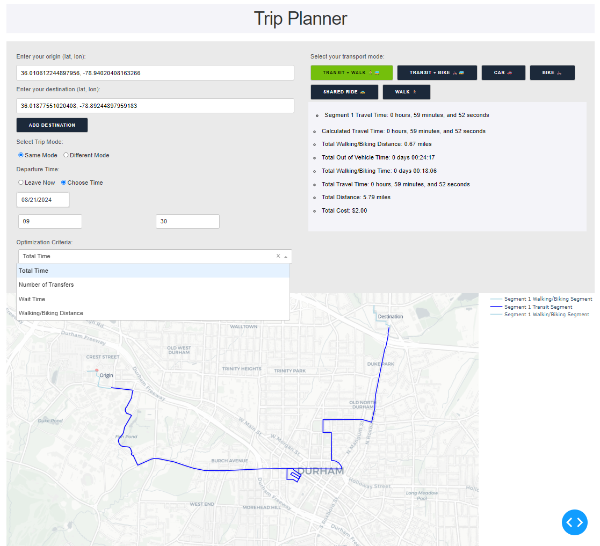
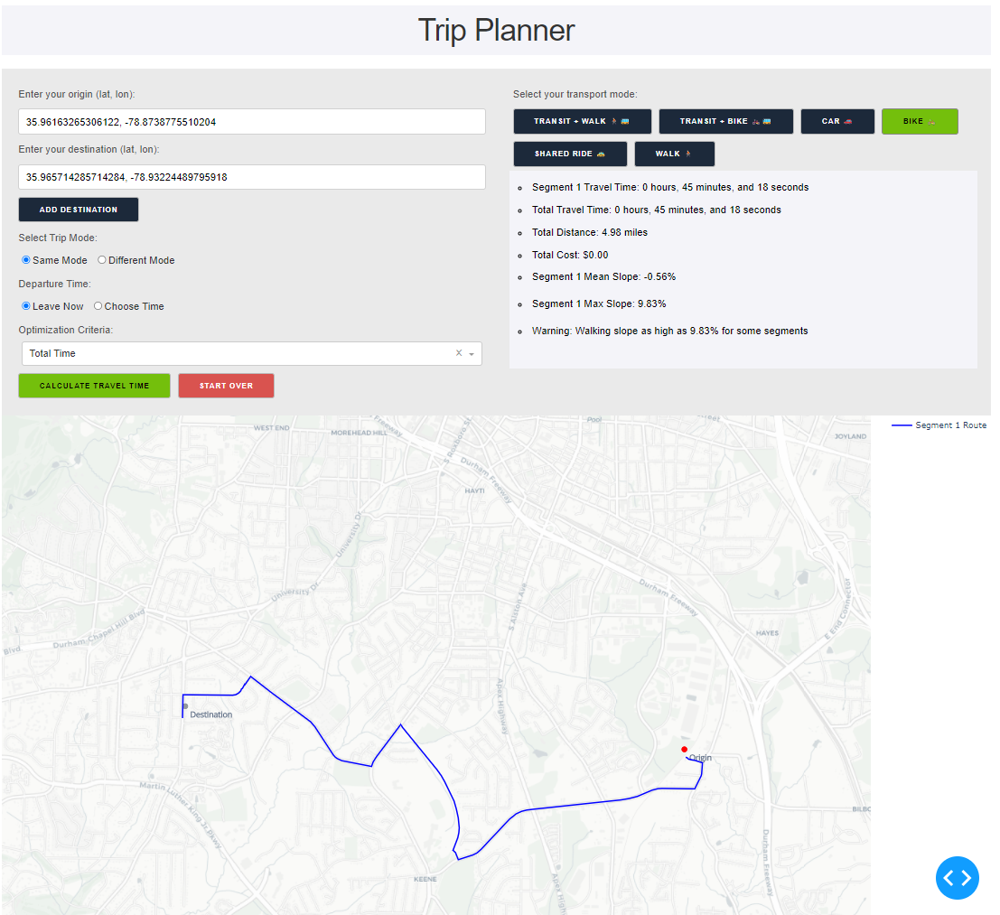
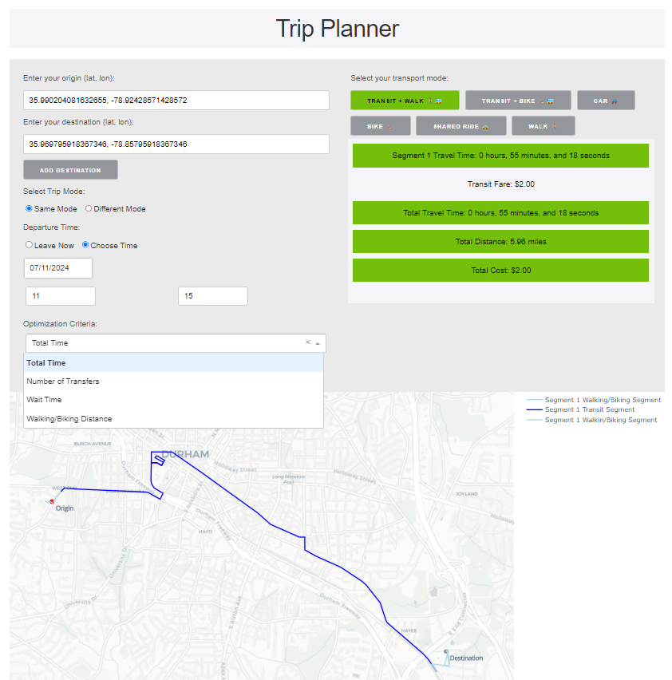
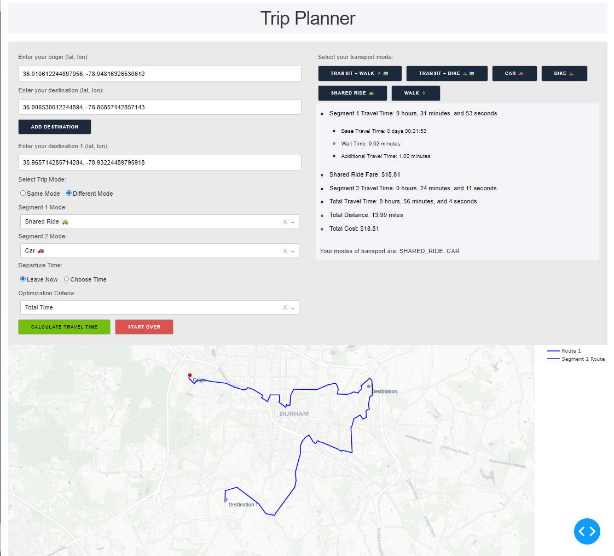

# Multimodal Trip Planner

A Plotly interface to show route and travel itinerary details for different transport modes building off the `r5py` library (Fink et al., 2022)

## Libraries needed
1. Pandas
2. Numpy
3. R5py
4. Geopandas
5. Dash/Plotly

## How to install r5py

1. **Clone the repository**:
    ```bash
    git clone https://github.com/r5py/r5py.git
    cd r5py
    ```

2. **Create a virtual environment** (optional but recommended):
    ```bash
    python -m venv env
    source env/bin/activate  # On Windows use `env\Scripts\activate`
    ```

3. **Install the required libraries**:
    ```bash
    pip install -r requirements.txt
    ```

4. **Install r5py**:
   ```bash
   cd r5py
   pip install -r pyproject.toml
   cd ..
   ```

5. **Clone the Trip Planner repository**:
    ```bash
    git clone https://github.com/RidwanTiamiyu/Multimodal-Trip-Planner.git
    cd Multimodal-Trip-Planner
    ```
    
6. **Run the application**:
    ```bash
    cd src/main
    python app.py
    ```

## Usage

1. **Launch the application**:
    After running `python app.py`, open your browser and navigate to `http://127.0.0.1:8050/` to view the app.

2. **Input your travel details**:
    - Set the origin and destination.
    - Select the transport mode.
    - View the detailed itinerary and route on the map.

## Documentation
[R5py](https://r5py.readthedocs.io/en/stable/user-guide/user-manual/quickstart.html)

[Dash](https://dash.plotly.com/tutorial)

[Geopandas](https://geopandas.org/en/stable/docs.html)

## Features

- Interactive map to display routes.
- Supports multiple transport modes.
- Displays detailed travel statistics.
- Responsive design for different devices.

## Example


#



## Ongoing Work
1. Work with multiple user criteria ( bike level of traffic stress, etc.)
2.  

## Note

For slope data, you need to download the elevation data (geotiff) for the location of interest. The file sizes are big and can't be uploaded on github.
[USGS website to download elevation data](https://www.usgs.gov/tools/national-map-viewer)


## Contributing

1. **Fork the repository**:
    Click the "Fork" button at the top-right corner of this page.

2. **Clone your fork**:
    ```bash
    git clone https://github.com/r5py/r5py.git
    cd r5py
    ```

3. **Create a branch**:
    ```bash
    git checkout -b my-feature-branch
    ```

4. **Make your changes and commit them**:
    ```bash
    git commit -am 'Add new feature'
    ```

5. **Push to the branch**:
    ```bash
    git push origin my-feature-branch
    ```

6. **Create a pull request**:
    Open your forked repository on GitHub and click "New pull request".

## License

This project is licensed under the MIT License - see the [LICENSE](LICENSE) file for details.

## Acknowledgments

- Thanks to the authors of the libraries used in this project.
- Fink, C., Klumpenhouwer, W., Saraiva, M., Pereira, R., & Tenkanen, H. (2022). r5py: Rapid Realistic Routing with R5 in Python (0.0.4). Zenodo. https://doi.org/10.5281/zenodo.7060438
- Special thanks to C2SMARTER, Tier-1 UTC for providing funds for the project.

