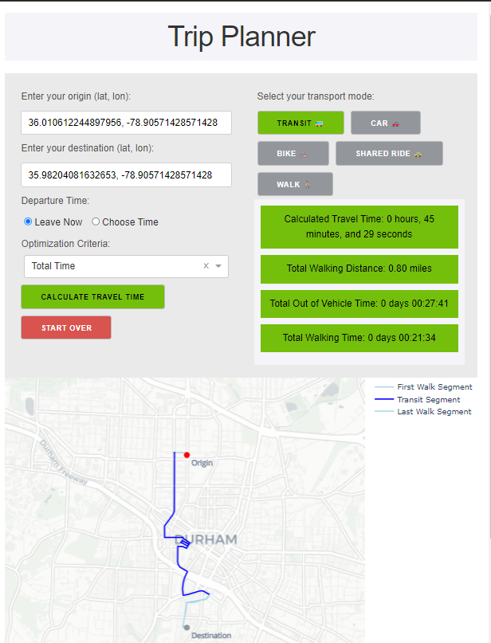
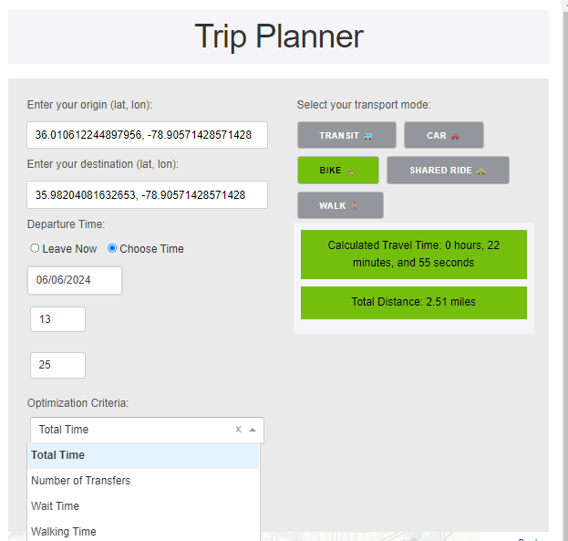

# Multimodal Trip Planner

A Plotly interface to show route and travel itinerary details for different transport modes.

## Libraries needed
1. Pandas
2. Numpy
3. R5py
4. Geopandas
5. Dash/Plotly

## How to install

1. **Clone the repository**:
    ```bash
    git clone https://github.com/your-username/r5py.git
    cd r5py
    ```

2. **Create a virtual environment** (optional but recommended):
    ```bash
    python -m venv env
    source env/bin/activate  # On Windows use `env\Scripts\activate`
    ```

3. **Install the required libraries**:
    ```bash
    pip install -r requirements.txt
    ```

4. **Run the application**:
    ```bash
    python app.py
    ```

## Usage

1. **Launch the application**:
    After running `python app.py`, open your browser and navigate to `http://127.0.0.1:8050/` to view the app.

2. **Input your travel details**:
    - Set the origin and destination.
    - Select the transport mode.
    - View the detailed itinerary and route on the map.

## Features

- Interactive map to display routes.
- Supports multiple transport modes.
- Displays detailed travel statistics.
- Responsive design for different devices.

## Example






## Contributing

1. **Fork the repository**:
    Click the "Fork" button at the top-right corner of this page.

2. **Clone your fork**:
    ```bash
    git clone https://github.com/your-username/r5py.git
    cd r5py
    ```

3. **Create a branch**:
    ```bash
    git checkout -b my-feature-branch
    ```

4. **Make your changes and commit them**:
    ```bash
    git commit -am 'Add new feature'
    ```

5. **Push to the branch**:
    ```bash
    git push origin my-feature-branch
    ```

6. **Create a pull request**:
    Open your forked repository on GitHub and click "New pull request".

## License

This project is licensed under the MIT License - see the [LICENSE](LICENSE) file for details.

## Acknowledgments

- Thanks to the authors of the libraries used in this project.
- Special thanks to the contributors who improved this project.

